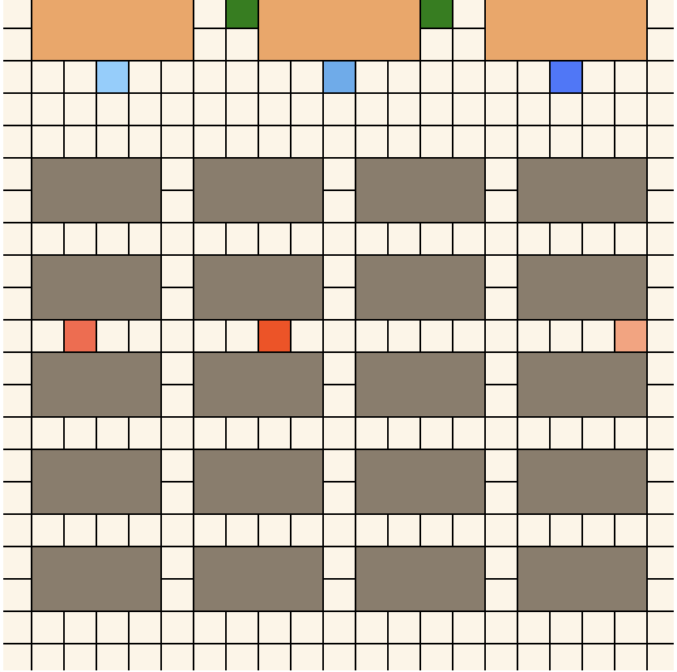
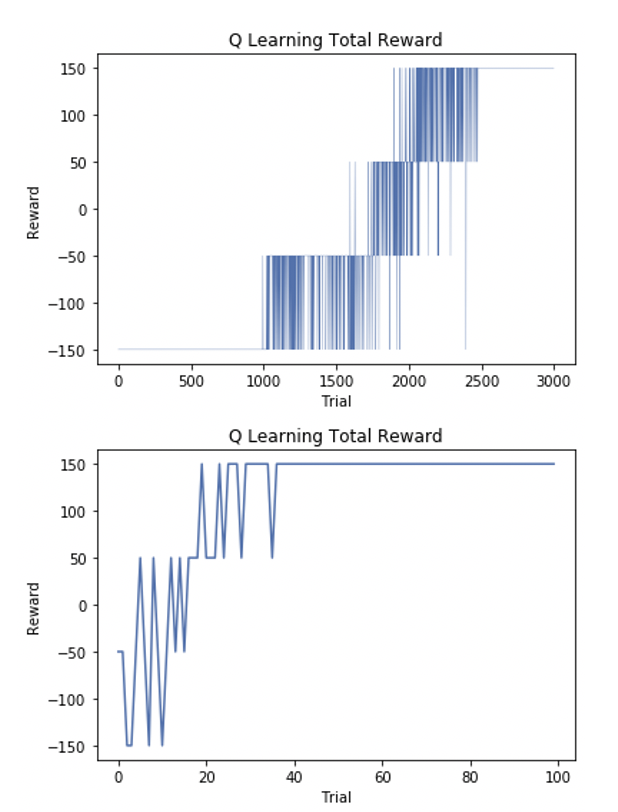
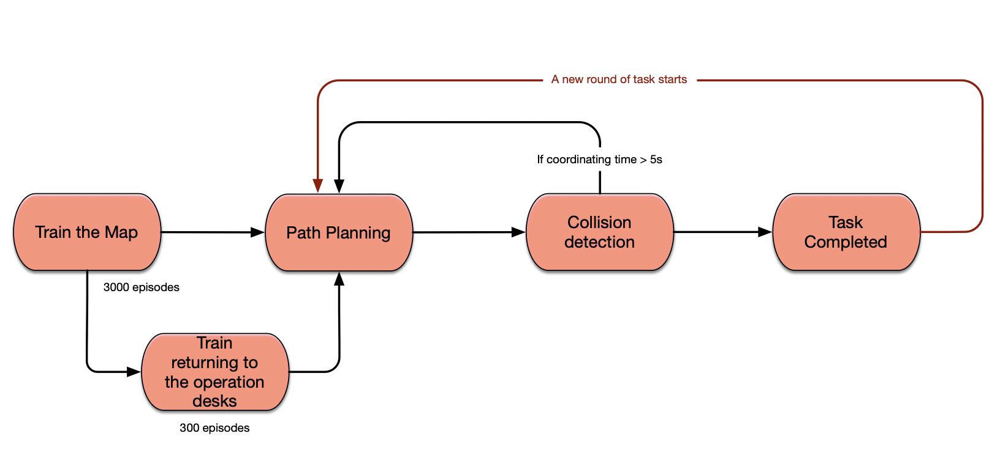
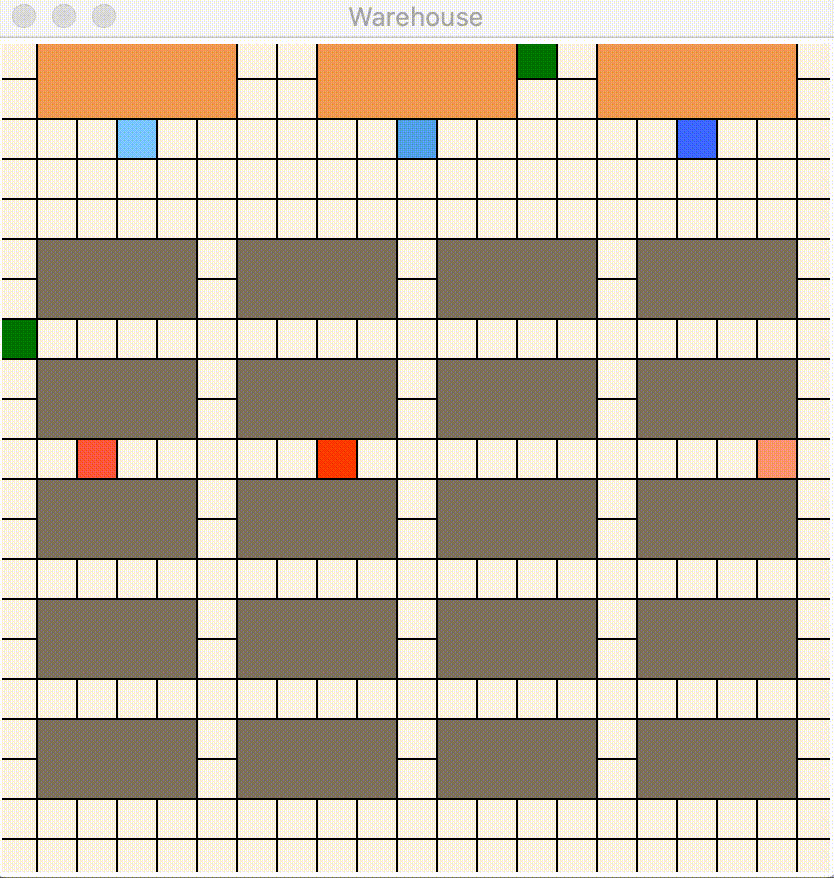

# WarehouseRobotPathPlanning
## Target
The target of this project is to provide a multi-robot path planning solution under a warehouse scenario using q learning. The robots should successfully arrive the storage target without hitting obstacles. Robots would start picking boxes from the operation desks, and after storage, they would return and start a new round of task.

## Approach
Q learning was mainly used for path planning. The idea is fairly easy. Without knowing any information of the environment, the robots would automatically explore the map. If one robot agent arrives the target, it would be rewarded 50 points. On the contrary, if it hits any obstacles, it would be punished by 50 points. In order to accelerate the training process, the idea of transfer learning was implied. Basically, the entire path planning task was divided into a hierarchy of  three subtasks. 

**Step1**

The first step is to train the map. An agent would be trained to get familiar with the warehouse map, and in this step, there would be no target position providing rewards. Only punishment of hitting the shelves and operation desks would be provided. 3000 episodes was performed in this step. 

**Step2**

The second step is to train the robots to return to the operation desks. Basically, the robots would start at random position in this map, and successfully returning to the operation desk would be rewarded. 

**Step3**

After the prior two steps, robots should learn enough knowledge of the surrounding situation. These prior information would be transferred to all robot agents, and the robots would be trained to approached to the final target. 

The transfer learning idea tremendously accelerate the training process. One more advantage is that, in the future, if new robot agents shall be added into this system, there is no need for them to start training from the sketch. The information from the first two steps would be inherited. In other word, this system is extendable. One before and after comparison of transfer learning is shown below:

Before transfer learning, the system is likely to converge after 2500 episodes.
Afterward, the system could converge within 50 episodes.
## Process Flow Chart

## Simulation

