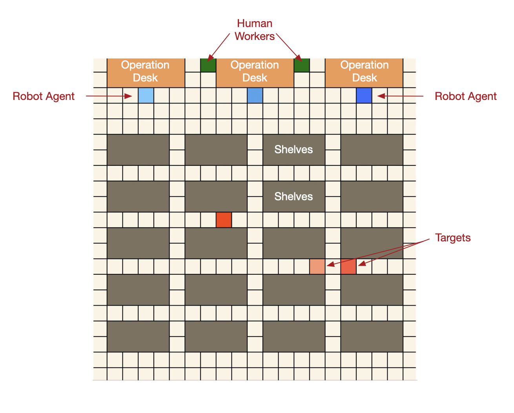

# Multi-Agent Path Planning and Collision Avoidance in Warehouse System
## Target
The target of this project is to provide a multi-robot path planning solution under a warehouse scenario using q learning. The robots should successfully arrive the storage target without hitting obstacles. Robots would start picking boxes from the operation desks, and after storage, they would return and start a new round of task.

## Approach
Q learning was mainly used for path planning. The idea is fairly easy. Without knowing any information of the environment, the robots would automatically explore the map. If one robot agent arrives the target, it would be rewarded 50 points. On the contrary, if it hits any obstacles, it would be punished by 50 points. In order to accelerate the training process, the idea of transfer learning was implied. Basically, the entire path planning task was divided into a hierarchy of  three subtasks. 

**Step1**

The first step is to train the map. An agent would be trained to get familiar with the warehouse map, and in this step, there would be no target position providing rewards. Only punishment of hitting the shelves and operation desks would be provided. 3000 episodes was performed in this step. 

**Step2**

The second step is to train the robots to return to the operation desks. Basically, the robots would start at random position in this map, and successfully returning to the operation desk would be rewarded. 

**Step3**

After the prior two steps, robots should learn enough knowledge of the surrounding situation. These prior information would be transferred to all robot agents, and the robots would be trained to approached to the final target. 

The transfer learning idea tremendously accelerate the training process. One more advantage is that, in the future, if new robot agents shall be added into this system, there is no need for them to start training from the sketch. The information from the first two steps would be inherited. In other word, this system is extendable. One before and after comparison of transfer learning is shown below:

Before transfer learning, the system is likely to converge after 2500 episodes.
Afterward, the system could converge within 50 episodes.
## Process Flow Chart

## Collision Avoidance

**Dynamic Obstacle**

* Robots vs. Robots
  1. Collision detection
  2. Waiting and starting coordination
  3. Comparing Manhattan distances towards the targets: the agent with shorter Manhattan distance should be endowed right of way
  4. Restarting moving in proper order
  
  (In this warehouse scenario, the Manhattan distance equals to the number of steps a robot would perform. So it is more intuitive to use Manhattan distance as the comparing criterion. If the robot could move in 8 directions (original 4 directions and diagonal movement), Chebyshev distance should be more appropriate to apply.) 

* Robots vs. Human Workers or Forklifts
  1. Collision detection
  2. Waiting for human workers to walk through (wait time < 5s)
  3. Restart moving

**Static Obstacle**

* Intended Obstacles
  * If one obstacle is intended to put into the warehouse environment. I assume that the position of the obstacle should be broadcast to all the robot agents (RFID, indoor GPS, etc.). The position of the obstacles should be taken into consideration in the third step of training to avoid waste of computing. 

* Temporary Obstacles
  * If one robot agent detects an obstacle, and waits there for more than 5 seconds. The agent would automatically walk back one step (if no obstacle in the back) and restart path planning process. (Shown on flow chart)
## Simulation

## How to run the code

1. Please modify line 45 of warehouse_test.py and line 17 of RLBrain.py to local file path
2. Run file warehouse_test.py

## Reference
[1] Choset, H., Lynch, K. M., & Hutchinson, S. (2005). Principles of robot motion: theory, algoritms, and implementations. Cambridge, MA: Bradford.

[2] Bertsekas, D. P. (2012). Dynamic programming and optimal control. Belmont, Mass: Athena Scientific. 

[3] Wang, Y.-C., & Usher, J. M. (2006). A reinforcement learning approach for developing routing policies in multi-agent production scheduling. The International Journal of Advanced Manufacturing Technology, 33(3-4), 323–333. doi: 10.1007/s00170-006-0465-y 

[4] Chen, C., Li, H.-X., & Dong, D. (2008). Hybrid Control for Robot Navigation - A Hierarchical Q-Learning Algorithm. IEEE Robotics & Automation Magazine, 15(2), 37–47. doi: 10.1109/mra.2008.921541 

[5] Dou, J., Chen, C., & Yang, P. (2015). Genetic Scheduling and Reinforcement Learning in Multirobot Systems for Intelligent Warehouses. Mathematical Problems in Engineering, 2015, 1–10. doi: 10.1155/2015/597956

[6] Panov, A. I., Yakovlev, K. S., & Suvorov, R. (2018). Grid Path Planning with Deep Reinforcement Learning: Preliminary Results. Procedia Computer Science, 123, 347–353. doi: 10.1016/j.procs.2018.01.054 

[7] Kamoshida, R., & Kazama, Y. (2017). Acquisition of Automated Guided Vehicle Route Planning Policy Using Deep Reinforcement Learning. 2017 6th IEEE International Conference on Advanced Logistics and Transport (ICALT). doi: 10.1109/icadlt.2017.8547000 

[8] Gupta, A., Devin, C., Liu, Y., Abbeel, P., & Levine, S. (2017). Learning Invariant Feature Spaces to Transfer Skills with Reinforcement Learning.

[9] Sutton, R. S., & Barto, A. (2018). Reinforcement learning: an introduction. Cambridge, MA: The MIT Press. 

[10] Taylor, M. (2009). Transfer in Reinforcement Learning Domains (Studies in Computational Intelligence, 216). Berlin, Heidelberg: Springer Berlin Heidelberg.

## License
MIT License

Copyright (c) 2020 Jingci Li

Permission is hereby granted, free of charge, to any person obtaining a copy
of this software and associated documentation files (the "Software"), to deal
in the Software without restriction, including without limitation the rights
to use, copy, modify, merge, publish, distribute, sublicense, and/or sell
copies of the Software, and to permit persons to whom the Software is
furnished to do so, subject to the following conditions:

The above copyright notice and this permission notice shall be included in all
copies or substantial portions of the Software.

THE SOFTWARE IS PROVIDED "AS IS", WITHOUT WARRANTY OF ANY KIND, EXPRESS OR
IMPLIED, INCLUDING BUT NOT LIMITED TO THE WARRANTIES OF MERCHANTABILITY,
FITNESS FOR A PARTICULAR PURPOSE AND NONINFRINGEMENT. IN NO EVENT SHALL THE
AUTHORS OR COPYRIGHT HOLDERS BE LIABLE FOR ANY CLAIM, DAMAGES OR OTHER
LIABILITY, WHETHER IN AN ACTION OF CONTRACT, TORT OR OTHERWISE, ARISING FROM,
OUT OF OR IN CONNECTION WITH THE SOFTWARE OR THE USE OR OTHER DEALINGS IN THE
SOFTWARE.
